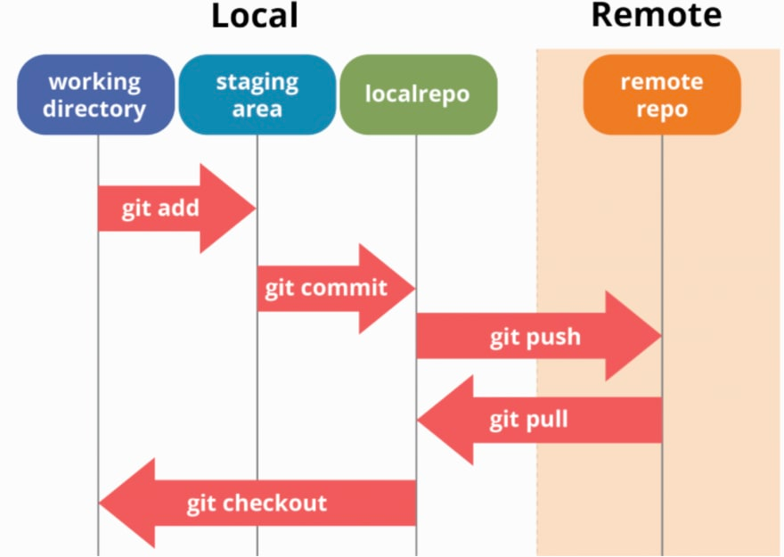

# Como instalar Git desde Ubuntu

## Índice

- [Como instalar Git desde Ubuntu](#como-instalar-git-desde-ubuntu)
  - [Índice](#índice)
  - [Explicación de como funciona git](#explicación-de-como-funciona-git)
  - [Creación de una carpeta](#creación-de-una-carpeta)
  - [Instalación de git](#instalación-de-git)
  - [Configuración del nombre, el email y el editor](#configuración-del-nombre-el-email-y-el-editor)
  - [Poner una clave SSH](#poner-una-clave-ssh)
  - [Como crear un nuevo repositorio en GitHub](#como-crear-un-nuevo-repositorio-en-github)
  - [Como crear un nuevo repositorio local](#como-crear-un-nuevo-repositorio-local)
  - [Como crear un commit](#como-crear-un-commit)
  - [Subir el repositorio a GitHib](#subir-el-repositorio-a-githib)

## Explicación de como funciona git

1. Git funciona con tres fases a nivel local y una fase a nivel remota o de red.  
2. Cuando creamos un archivo y los modificamos en una carpeta inicializada como repositorio, estaremos situados en la primera fase, denominada "Working directory". Cualquier archivo que modifiquemos pasará automáticamente a este punto. Para pasar a la siguiente fase del desrrollo tendremos que usar el comando **git add**.   
3. Después de usar este comando, estaremos situados en el "Staging area", que será donde estarán los archivos listos para realizar un commit (una instantánea del proyecto que posteriormente dirá que cambios hubo de una versión a otra). Para pasar a la siguiente estapa del proyecto se usará el comando **git commit**. Los commits sirven para guardar puntos del 
proyecto para volver a ellos en momentos posteriores.    
4. Una vez hecho este comando, estaremos en el "local repo" donde estarán guardadas las versiones del proyecto que estaremos haciendo. Para subir a GitHub o a cualquier otro repositorio en remoto como GitLab, se usará el comando **git push**, esto permite tener los proyectos subidos en la nube, con lo que se puede colaborar con más personas.  



Para saber en que fase estamos, usaremos el comando **git status**, si tenemos archivos modificados nos dirá cuales modificamos y si hay alguno en el Staging area también no los indicará.  

## Creación de una carpeta

Comenzaremos creando una carpeta en la que se alojarán los futuros repositorios de git, para ello abriremos la consola de comandos con *Ctrl + Alt + T*, y primero veremos donde estamos situados.  

```sh
pwd
# /home/alexbs01
```
Y desde este directorio crearemos una carpeta llamada "proyectosGit" y entraremos a ella.    

```sh
mkdir proyectosGit
cd proyectosGit
```

## Instalación de git

Ahora instalaremos git con estos dos comandos. Estos comandos son para Linux, si es desde Windows habrá que bucar en el navegador, descargar el ejecutable y dejar todo por defecto. Luego la configuración será igual si se abre Git Bash.  

```sh
sudo apt update -y
sudo apt install git -y
```

A continuación, para comprobar que se instaló correctamente usaremos un comando de git para ver en que version está.  

```sh
git --version
# git version 2.24.1
```

## Configuración del nombre, el email y el editor

Una vez tengamos instalado Git procederemos a configurar el nombre, el email y el editor. Para este paso lo mejor es que primero nos registremos en GitHub, para después, subir ahí los commits que vayamos creando, y además, para tener el mismo nombre en Git y en GitHub. Comenzaremos registrándonos y después escribiremos estos comandos.  

```sh
git config --global user.name "alexbs01"
git config --global user.email "alex.becerra.suarez01@gmail.com"
git config --global core.editor "nano"
```

En el nombre del editor vale cualquiera, ya sea nano (Yo uso este), gedit, vim (Este sólo para expertos o si sabes salir de él)...  

Y para ver si se configuró correctamente ejecutaremos el siguiente comando que mostrará lo que escribimos anteriormente.  

```sh
git config --list --show-origin
```

## Poner una clave SSH

Generaremos una clave SSH con el comando, iniciamos el agente y agregamos la clave privada SSH al ssh-agent. Las claves SSH nos permiten mayor seguridad y facilidad a la hora de subir código. Durante la generación de la clave (el primer comando de abajo), preguntará por dos cosas, donde guardar las claves SSH que como por facilidad yo las dejaría en su ubicación por defecto. Y si queremos guardarla contraseña bajo una contraseña, que aquí mi recomendación es ponerle una porque si subes código a una organización o un repostorio creado por GitHubClassroom, es muy habitual que si no tiene contraseña la clave SSH no permita subir commits.   

```sh
ssh-keygen -t rsa -b 4096 -C "alex.becerra.suarez01@gmail.com"
eval "$(ssh-agent -s)"
ssh-add ~/.ssh/id_rsa
```

Y ahora instalamos el xclip para copiar la clave pública SSH. O bien, podemos abrir el archivo de la clave pública y copiarlo a cañón. Cómo este archivo está en la carpeta .ssh de la carpeta del usuario. **Es muy importante copiar entero el archivo .pub**. Si estamos en Windows lo mejor será usar el segundo método que es el que normalmente utilizo.  

```sh
sudo apt instal xclip
xclip -sel clip < ~/.ssh/id_rsa.pub
```

Ahora copiamos la clave que nos aparece y en GitHub nos dirigimos a al apartado de "Settings" que está en nuestro icono de GitHub. Buscamos el punto en el que pone "SSH and GPG keys", y le damos al "New SSH key", pegaremos la clave que copiamos anteriormente y pondremos un título para identificarla. Porque podemos usar varios ordenadores o simplemente varios sistemas operativos y cada uno necesita su propia clave.  

## Como crear un nuevo repositorio en GitHub

Iniciamos sesión en GitHub y arriba a la derecha nos aparecerá una campana, un símbolo más con un triángulo y nuestra foto de perfil. Pulsaremos en el más y crearemos un nuevo repositorio entrando en "New repository".  
Rellenamos los campos, donde podremos escoger el nombre, ponerle una descripción y decidir si ese repositorio será público o privado.  

## Como crear un nuevo repositorio local

En el primer paso creamos una carpeta, con el comando mkdir, que almacenará los repositorios que vayamos creando.  
Así que ahora entramos en dicha carpeta usando el comando cd.  

```sh
cd proyectosGit
```

Ahora, una vez dentro de esta carpeta, crearemos otra carpeta llamada "Prueba" y entraremos para inicializarlo como repositorio.  

```sh
mkdir Prueba
cd Prueba
```

E inicializamos la carpeta como un repositorio de git con el comando:  

```sh
git init
```

A continuación, con la carpeta ya inicializada como repositorio, **crearemos un archivo de Markdown que será el que subiremos a GitHub** cuando hay que seguirle el control de versiones a un proyecto. Por lo general, el primer archivo del repositorio se llama README, y **tendrá la extensión ".md"** para que se reconozca que es un texto en Markdown.  

```sh
touch README.md
```

## Como crear un commit

Ahora para editar el nuevo archivo pondremos el comando:  

```sh
sudo nano README.md
```

Y se nos abrirá el editor de texto que escogimos, que en este caso es *nano*. A continuación, pondremos cualquier cosa para que después veamos como se ve. Al ser en Markdown, un titular h1 y un párrafo de html se crean así.  

```markdown
# Prueba de titular h1
Prueba de párrafo
```

Ahora lo guardamos con "Ctrl + O (letra)" y lo cerramos con "Ctrl + X".  
Pondremos el comando:

```sh
git status
```

Y el archivo README.md nos saldrá en rojo y modificado, esto es porque ahora mismo estamos en el working area y con el comando:  

```sh
git add README.md
```

Pasaremos al staging area, también si tenemos varios archivos, podemos escribir ```git add .```, el . simboliza todos los archivos.  

Este punto que ponemos en lugar del nombre del archivo simboliza a todo los archivos del repositorio. Si ponemos **git status** nos saldrá en verde y modificado, ahora que está así, está listo para hacerle un commit y guardar el estado del proyecto.  
Con el comando **git commit** haremos una instantánea del trabajo que posteriormente nos servirá para ver las modidicaciones que le hicimos al proyecto en cada momento.  

```sh
git commit -m "NombreDelCommit"
```

Si ponemos simplemente ```git commit``` se nos abrirá el editor de textos que tengamos como predeterminado para poner un 
nombre de commit y una explicación mucho más extensa. Esta opción es recomendable en proyectos grandes, con 
funcionalidades importantes o en resolución de errores.  

## Subir el repositorio a GitHib

Después de hacer commit, si probamos a hacer el comando **git status** veremos que nos dice que no hay nada a que hacerle commit.  
Ahora como lo que queremos es subirlo a GitHub lo que haremos es ir al repositorio que creamos anteriormente desde la página y copiaremos y pegaremos en la línea de comandos los comandos que están a continuación del commit, suelen tener esta forma, aunque es probable que en vez de master sea main.  

```sh
git remote add origin ElNombreQueTeMarqueLaPágina
git push -u origin master
```

Tras hacer estos dos comandos se subirá a GitHub el archivo que editamos anteriormente. Cuando ya tengamos hecho esto porm primera vez en este repositorio, para la próxima vez que haya que subir un nuevo commit, solo habrá que poner:  

```sh
git push
```

-----

Si tenemos nuestra cuenta de GitHub en otro ordenador y subimos cosas desde ambos, la mejor forma de tener el proyecto en el otro ordenador es clonar el repositorio correspondiente.  
Para esto iremos al repositorio que queremos clonar nos saldrá un rectángulo verde que pone "Clone or download", le daremos y copiaremos el link que aparece dentro.  

```sh
cd projects
git clone LinkQueAcabamosDeCopiar
```

Ahora tenemos el repositorio en el local, ahora cada vez que queramos subir algo nuevo usaremos el comando de **git push**. Sin embargo a la hora de actualizar el repositorio local porque añadimos cosas nuevas desde otro ordenador, solo tendremos que usar est comando para descargar los cambios:  

```sh
git pull
```

Porque ya tendremos añadido ese repositorio en el local, **solo habrá que usar el comando git clone la primera vez que queramos tener un repositorio en un nuevo ordenador**.  
